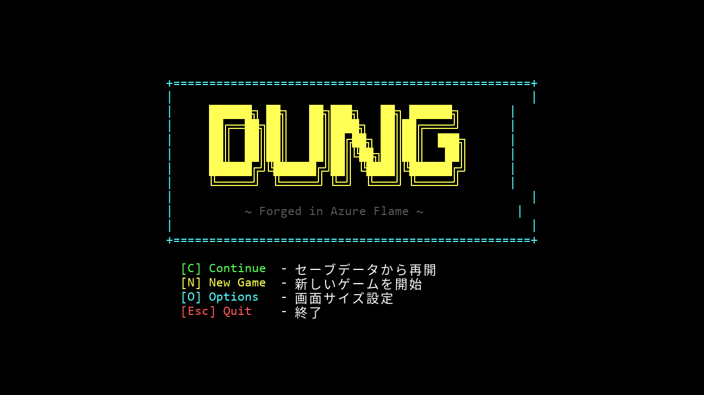
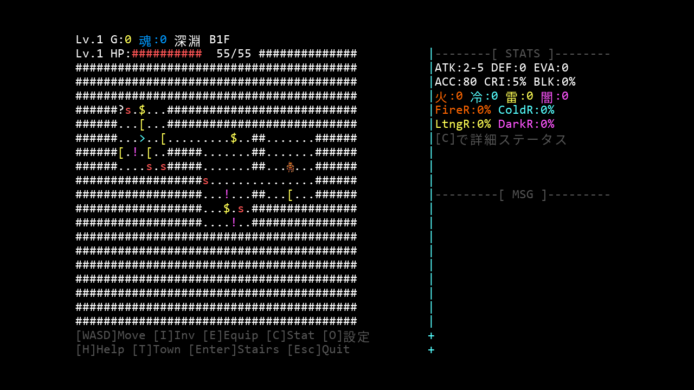
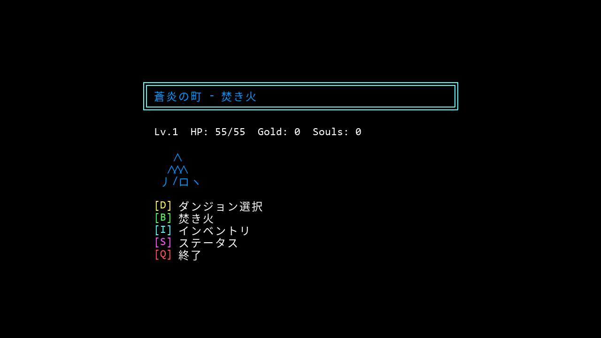
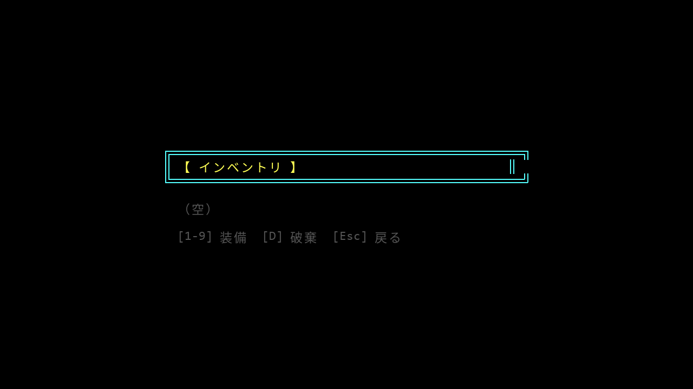

<p align="center">
  
</p>

<h1 align="center">Azure Flame Toolkit</h1>

<p align="center">
  <strong>Autonomous AI toolkit that powers a 22,000-line roguelike RPG and a full marketing pipeline &mdash; built by a non-engineer using Claude Code.</strong>
</p>

<p align="center">
  <a href="https://yurukusa.itch.io/azure-flame-dungeon"></a>
  <a href="https://youtu.be/Ccp_uZnsxi4"></a>
  <a href="https://ko-fi.com/yurukusa"></a>
</p>

<p align="center">
  
  
  
  
  
  
</p>

---

## What Is This?

This toolkit enables [Claude Code](https://claude.com/claude-code) to operate as a fully autonomous agent -- browsing the web, posting content, managing accounts, and building software -- all triggered by a single `instructions.md` file written in plain language.

It was built alongside **DUNG: Azure Flame**, a 22,000-line roguelike RPG ([play on itch.io](https://yurukusa.itch.io/azure-flame-dungeon)), as part of a system where a non-engineer uses AI to handle the entire lifecycle of a software product: development, marketing, distribution, and community management.

**Zero lines of code were written by a human.** Everything in this repository was generated by Claude Code (Opus 4.6).

> *Every morning, I write what I want in `instructions.md`. Claude Code does the rest.*

---

## The Game: DUNG: Azure Flame

<p align="center">
  
  
</p>
<p align="center">
  
  
</p>

A terminal-style roguelike RPG inspired by Diablo II and Dark Souls. 22,000+ lines of Python/Pygame, every line generated by AI.

| Feature | Details |
|---------|---------|
| **Combat** | Turn-based with elemental resistances (Fire/Cold/Lightning/Dark), critical hits, tactical retreats |
| **Equipment** | 10 slots, 6 rarity tiers (Normal to Legendary), tiered affixes, socketing system |
| **Death System** | Lose everything on death -- or spend souls to recover ONE item. The core risk/reward loop. |
| **Town Building** | Develop your base from a bonfire to a full town (Lv0-Lv5) with merchants, storage, and forge |
| **Dungeons** | 4 themed areas up to 99 floors with procedural generation |
| **Forge** | Reroll stats, add affixes, upgrade rarity, corrupt items for high-risk rewards |
| **Gem System** | Endgame socketing with trigger/skill/support gems for build-defining combos |
| **Auto-Explore** | Automated dungeon traversal for efficient farming |

> Do you hoard souls to develop your town? Or save them to protect your best gear from death? Every decision matters.

---

## Toolkit Components

### chrome-bridge/

CDP (Chrome DevTools Protocol) browser automation via WebSocket + Chrome Extension. Gives Claude Code full control over a web browser.

```
Claude Code ──→ client.js ──→ WebSocket Server (port 8765)
                                    │
                    ┌───────────────┼───────────────┐
                    ▼                               ▼
             Chrome Extension               CDP Direct Mode
             (content scripts)              (DevTools Protocol)
                    │                               │
                    ▼                               ▼
              Page Interaction              Main-World JS Execution
              (click, type, read)           (bypasses CSP)
```

**Capabilities:**
- Navigate pages, click elements, fill forms, upload files
- Execute JavaScript in page main-world context (bypasses Content Security Policy)
- Read DOM content, take screenshots, monitor console and network
- MCP server mode for direct integration with Claude Code tools

**Real-world challenges solved:**
- Shadow DOM navigation (Reddit's new UI)
- Lexical rich-text editor interaction
- CodeMirror 6 editor manipulation (Zenn)
- Blob/File API uploads (itch.io game file uploads)

### claude-watch/

File-polling daemon that turns `instructions.md` into autonomous Claude Code execution sessions.

```
instructions.md modified
        │
        ▼
claude-watch detects change (polls stat every 5s)
        │
        ▼
Extracts instruction-id (deduplication)
        │
        ▼
Launches Claude Code with instructions as prompt
        │
        ▼
Records result in execution history
```

- **Why polling?** WSL2 cannot reliably detect Windows-side file changes via inotify
- **Deduplication:** instruction-id in the file header prevents re-execution
- **Zero dependencies:** Pure Bash, no external packages required

### cc-chrome

Dedicated Chrome launcher for AI operations. Creates an isolated Chrome profile so AI browser sessions never collide with human browsing. Exposes CDP on port 9223 with `--remote-debugging-address=0.0.0.0` for WSL2 access.

---

## Architecture

```
                    ┌──────────────────────────────────┐
                    │         Human (yurukusa)          │
                    │   Writes instructions.md in       │
                    │   plain language (Japanese/English)│
                    └───────────────┬──────────────────┘
                                    │ file change detected
                    ┌───────────────▼──────────────────┐
                    │         claude-watch              │
                    │   Polls every 5s via stat -c %Y   │
                    │   Deduplicates by instruction-id  │
                    └───────────────┬──────────────────┘
                                    │
                    ┌───────────────▼──────────────────┐
                    │      Claude Code (Opus 4.6)       │
                    │   Reads → Plans → Executes        │
                    │   22,000+ lines generated         │
                    └───┬───────────┬──────────────┬───┘
                        │           │              │
              ┌─────────▼───┐ ┌────▼──────┐ ┌─────▼───────────┐
              │  File I/O    │ │ Git/CLI   │ │ chrome-bridge   │
              │  Read, Write │ │ commit    │ │ WebSocket + CDP │
              │  Edit code   │ │ push      │ │ MCP server      │
              └─────────────┘ └───────────┘ └─────┬───────────┘
                                                   │
                                            ┌──────▼──────┐
                                            │  cc-chrome   │
                                            │  Isolated    │
                                            │  Chrome      │
                                            └──────┬──────┘
                                                   │
                              ┌────────┬───────────┼───────────┐
                              │        │           │           │
                        ┌─────▼──┐ ┌───▼────┐ ┌───▼────┐ ┌───▼────┐
                        │ Reddit │ │itch.io │ │  Zenn  │ │YouTube │
                        │ posts  │ │ manage │ │articles│ │uploads │
                        └────────┘ └────────┘ └────────┘ └────────┘
```

---

## Tech Stack

| Layer | Technology | Role |
|-------|-----------|------|
| **AI Engine** | Claude Code (Opus 4.6) | All code generation and autonomous task execution |
| **Game** | Python 3.12 + Pygame | 22,000-line terminal-style roguelike RPG |
| **Browser Automation** | Node.js + WebSocket + CDP | Chrome control for web interactions |
| **Chrome Extension** | Manifest V3 + Offscreen API | In-page DOM access and content script bridge |
| **MCP Server** | @modelcontextprotocol/sdk | Direct tool integration with Claude Code |
| **Task Runner** | Bash (claude-watch) | File-polling daemon for autonomous execution |
| **Browser Instance** | Bash (cc-chrome) | Isolated Chrome profile for AI operations |
| **Video** | Remotion (React) | Programmatic promo and demo video creation |
| **Distribution** | itch.io | Game hosting and sales |
| **Environment** | WSL2 on Windows | Development platform bridging Linux and Windows |

---

## Setup

### chrome-bridge

```bash
cd chrome-bridge
npm install

# Start the WebSocket server
node server.js &

# Load the Chrome extension:
#   1. Open chrome://extensions
#   2. Enable "Developer mode"
#   3. Click "Load unpacked" → select the extension/ directory

# CLI usage
node client.js navigate "https://example.com"
node client.js evaluate "document.title"
node client.js cdpClick "#submit-button"
node client.js cdpType "#search-input" "query text"

# MCP server mode (for Claude Code integration)
# Add to Claude Code MCP config:
#   "chrome-bridge": { "command": "node", "args": ["mcp-server.js"] }
```

### claude-watch

```bash
# Install
cp claude-watch/claude-watch ~/bin/
chmod +x ~/bin/claude-watch

# Start watching (recommended: run in tmux)
tmux new-session -d -s watch "claude-watch --fg ~/instructions.md"

# Control commands
claude-watch --status     # Check if running
claude-watch --stop       # Stop the watcher
claude-watch --log        # View execution logs
claude-watch --history    # View execution history
```

### cc-chrome (WSL2 only)

```bash
# Install
cp claude-watch/cc-chrome ~/bin/
chmod +x ~/bin/cc-chrome

# Launch dedicated Chrome instance
cc-chrome

# Verify CDP is accessible
curl http://localhost:9223/json/version
```

---

## Metrics

| Metric | Value |
|--------|-------|
| Total lines of code generated | **22,000+** |
| Lines written by human | **0** |
| Game systems implemented | 15+ (combat, equipment, town, forge, gems, death, dungeons, auto-explore...) |
| CDP automation scripts created | 34 |
| Reddit posts automated | 5+ |
| Articles published autonomously | 2 (Zenn + note) |
| Promo videos generated | 4 |
| Development time | ~2 weeks |

---

## The Story

I am an indie game developer who does not write code -- not Python, not JavaScript, not anything.

Using Claude Code with Opus 4.6, I built a complete roguelike RPG from scratch, created browser automation tools, published marketing content across multiple platforms, and submitted to a hackathon -- all by writing instructions in plain language.

The most memorable moment: during Discord account setup, Claude Code autonomously generated 34 PowerShell scripts to attempt solving hCaptcha. It correctly identified every image (hamsters, cleaning supplies, cows) but could not click fast enough before the 30-second timeout. The solution was one human click on a checkbox. That moment captures the essence of human-AI collaboration perfectly: **AI handles the complexity, humans handle what only humans can.**

This project exists to prove one thing: **the boundary between "engineer" and "non-engineer" is dissolving.**

---

## Repository Structure

```
azure-flame-toolkit/
├── chrome-bridge/
│   ├── server.js          # WebSocket server (port 8765)
│   ├── server-cc.js       # Server variant for cc-chrome (port 8766)
│   ├── client.js          # CLI client for browser commands
│   ├── mcp-server.js      # MCP server for Claude Code integration
│   ├── extension/         # Chrome extension (Manifest V3)
│   │   ├── manifest.json
│   │   ├── background.js  # Service worker
│   │   ├── content.js     # Content script for DOM access
│   │   ├── offscreen.js   # Offscreen document for CDP
│   │   ├── popup.html/js  # Extension popup UI
│   │   └── ...
│   └── package.json
├── claude-watch/
│   ├── claude-watch       # File-polling daemon (Bash)
│   └── cc-chrome          # Dedicated Chrome launcher (Bash)
├── screenshots/           # Game screenshots
└── README.md
```

---

## Built with Opus 4.6

This project was built for the [Built with Opus 4.6: a Claude Code hackathon](https://cerebralvalley.ai/e/claude-code-hackathon) by Cerebral Valley and Anthropic.

---

## Links

| | |
|---|---|
| **Play the Game** | [yurukusa.itch.io/azure-flame-dungeon](https://yurukusa.itch.io/azure-flame-dungeon) |
| **YouTube Trailer** | [youtu.be/Ccp_uZnsxi4](https://youtu.be/Ccp_uZnsxi4) |
| **Support on Ko-fi** | [ko-fi.com/yurukusa](https://ko-fi.com/yurukusa) |
| **Technical Article (JP)** | [zenn.dev/yurukusa/articles/fc378dfbb37a5b](https://zenn.dev/yurukusa/articles/fc378dfbb37a5b) |

---

## License

MIT
